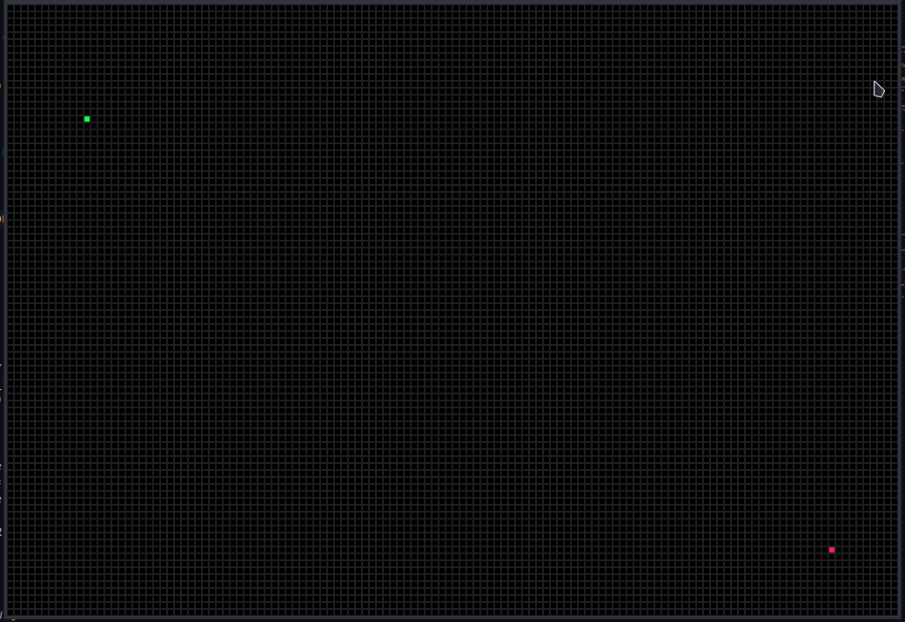

| Control                | Description                         |
| ---------------------- | ----------------------------------- |
| **Space**              | Visualize a\* pathfinding           |
| **Left mouse button**  | Place an obstacle                   |
| **Right mouse button** | Remove an obstacle                  |
| **s key**              | Place the start node                |
| **g key**              | Place the goal node                 |
| **m key**              | Generate a map                      |
| **e key**              | Simualte one generation for the map |
| **c key**              | Clear the path and obstacles        |
| **Alt + F4**           | Quit game                           |

